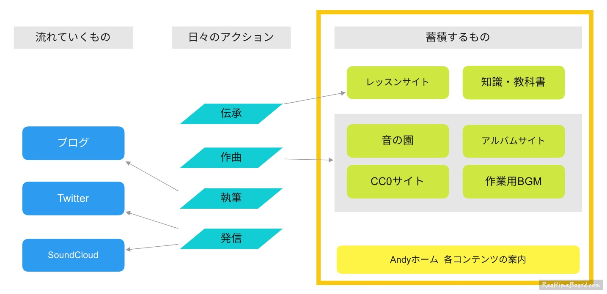
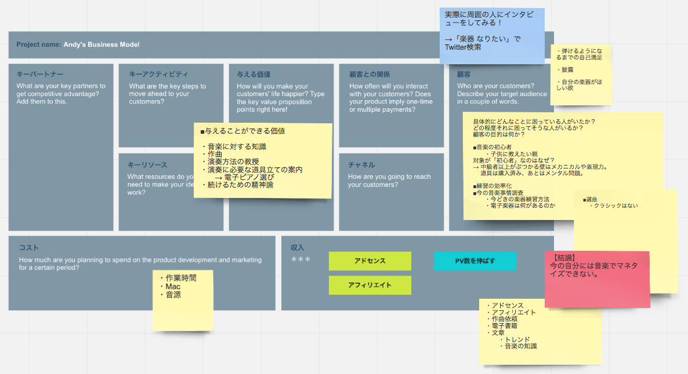

meeting
=======

### 進捗状況 - 2016.10.29

| 企画                           | 状況    |
|--------------------------------|---------|
| フリー音楽素材サイト「音の園」 | 158 曲   |
| 初心者向け作曲レッスンサイト   | ボツ、今やることじゃない  |
| 著作権フリーCC0音楽素材サイト  | 保留  |
| Wild Neverland 世界観          | 構想中  |
| 作業用BGMサイト                | 構想中  |
| ヘタクソ絵大喜利サイト「画伯」 | 構想中  |
| アンビエント | 構想中  |

### ホワイトボード
- __[RealtimeBoard](https://realtimeboard.com/)__

### Next

- アンビエント
    - アビスリウム

- レッスンサイト
    - [ドットインストール](http://dotinstall.com/)
    - 本当に右も左もわからない人向け
    - VOCALOID

- CC0サイト
    - 作曲プロジェクトファイルも配っちゃえ
    - 動画のBGMとか、使う場面を最初に決めて作る

- 作業用BGMサイト
    - [キーワードで動画検索 作業用BGM - ニコニコ動画:GINZA](http://www.nicovideo.jp/search/%E4%BD%9C%E6%A5%AD%E7%94%A8BGM?sort=v&order=d)

- Wild Neverland
    - 妄想取説
    - 情報量的にはゲームの公式サイトくらい

- 画伯
    - お題「ガガピー」→ みんなが投稿 → 一番笑えるのが優勝
    - ヘタクソじゃないとダメ。うまいとdisられる

### Tasks

- [ ] サイト名称
- [ ] コンテンツ検討

### Aim

- これから始めたい人を取り込む

## 企画

### プロモーション
自分を売っていくための施策

### 曲を利用する場面

- 夜のドライブで流せる曲
- 曲のバリエーション展開
- PodcastのBGM
- Youtube、ニコ動のBGM

### 曲の入手

- 音楽素材サイトにて出来合いのものを入手
    - → 音楽素材サイトの作成
- 音楽アプリを使って簡単に自作（議事録 2015-04-11）
    - → 活用事例やレビューを集めたサイトづくり

### ターゲットユーザ

- これから作曲を学んでいきたいという人
    - 昔からゲーム音楽を聴いてきた知識を提供できる
    - 何を作りたいかによる。歌もの・インスト
    - ゲーム音楽に絞ってもよいが、もはや境目はない
- ファンタジーな曲が好きな人

### ブログのネタ

- アルバムの曲ごとに解説・感想
    - FF4のサントラ
    - ワーネバサントラの細かい話
- フリーゲームのレビュー

### マネタイズ

- メロディだけ依頼でもらってアレンジして返す商売
- 「動画編集 BGM」の検索に応える
- DAWの解説動画 → アフィリエイト
- ジブリ音楽の自己流再現
